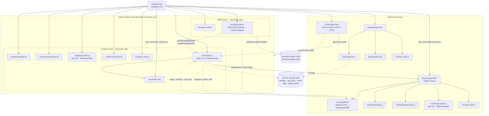
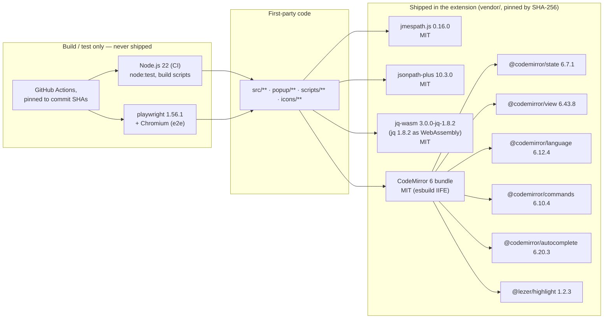
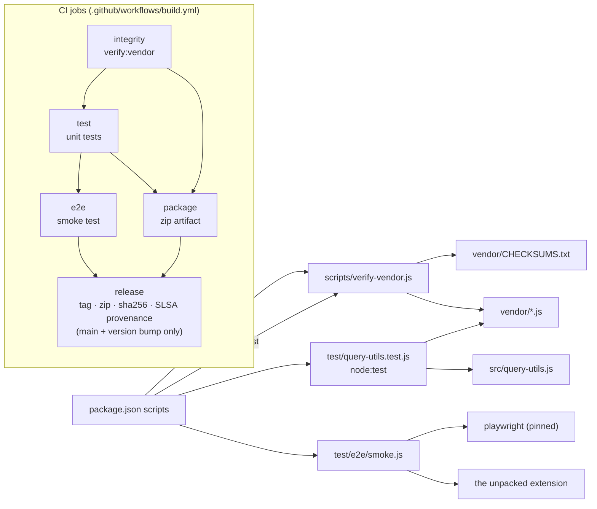

# Dependency graph

How the pieces of this extension depend on each other — the *internal* graph
(which file loads, imports, or messages which) and the *external* graph (the
third-party components, all vendored). The component inventory with versions,
licenses, and hashes lives in [SBOM.md](../SBOM.md); this document is the
picture that goes with it.

Nothing here is generated: keep it in step with `manifest.json`,
`src/evaluator.html`, `popup/popup.html`, and `.github/workflows/build.yml`
when those change.

## Runtime: what loads what

The extension has no bundler and no module system. Every dependency edge is a
declaration in `manifest.json`, a `<script src>` in an extension page, or a
`postMessage`/`chrome.*` channel between two contexts. Solid arrows are load
edges (A pulls in B); dashed arrows are message channels.

Reading the graph:

- **`src/query-utils.js` is the shared leaf.** It is loaded four times over
  (MAIN world, isolated world, evaluator frame, popup) as an independent copy
  in each context — it is UMD, side-effect free, and depends on nothing, which
  is exactly why it can be. It is also the only source file `test/` requires
  directly.
- **Nothing depends on `src/content.js`.** The panel is the top of the runtime
  graph; the query engines, the editor bundle, and the evaluator frame are all
  below it.
- **The vendored query engines are loaded twice** — once in the isolated world
  (small-dataset fast path) and once in the evaluator frame (everything large).
  `vendor/codemirror.js` is loaded only in the isolated world; the evaluator
  has no UI.
- **`src/interceptor.js` never depends on the panel.** It observes `fetch`/XHR
  and posts outward, so a panel that failed to attach cannot break capture.
- **The only outbound edge to the network** is interceptor → Graph hosts for
  `@odata.nextLink` pages. There is no edge from any node to a CDN, an
  analytics endpoint, or a remote script — see [SECURITY.md](../SECURITY.md).

## Third-party components

Every third-party library is committed as a pre-built, version-pinned bundle
under `vendor/` and integrity-checked on each build, so the runtime graph
below is closed — nothing is resolved at install time.

The query-language tokenizers the editor uses are first-party
(`nextQueryToken` in `src/query-utils.js`), not part of the CodeMirror bundle —
so the editor has no language-package dependencies beyond the six above.

## Build, test, and release

`integrity` is the gate every other job depends on: a modified, missing, or
unlisted vendored bundle fails the build before anything is tested or shipped.

## The dependency graph on GitHub

GitHub's own view of this repository lives under **Insights → Dependency
graph**, and it is fed by two manifests:

| Manifest | What GitHub sees | Kept current by |
| --- | --- | --- |
| `.github/workflows/build.yml` | every GitHub Action used, at its pinned commit SHA | Dependabot (`github-actions` ecosystem, weekly) |
| `package.json` | `playwright` — the single pinned dev/test tool | Dependabot (`npm` ecosystem, weekly) |

Two consequences worth knowing when reading that tab:

- **There are no runtime npm dependencies to show, by design.** The shipped
  extension installs nothing; the libraries it runs are the vendored bundles
  above, which are plain committed files and therefore invisible to GitHub's
  resolver. `SBOM.md` and `vendor/CHECKSUMS.txt` are the authority for those,
  and `npm run verify:vendor` is the check that enforces them.
- **There is intentionally no `package-lock.json`.** With no lockfile GitHub
  lists direct dependencies only — which here is the complete set.

Dependabot alerts and security updates apply to what is in that graph
(Actions, Playwright). Vulnerabilities in the vendored engines are handled by
updating the bundle: see the vendored-dependency instructions in
[CONTRIBUTING.md](../CONTRIBUTING.md).
